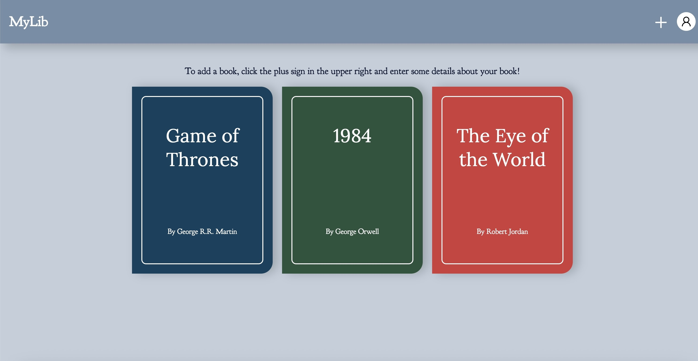

# 📚 MyLib

**MyLib** is a simple library web application that allows users to store information about books they’ve read and keep track of their current reading progress.  

Built with **HTML, CSS, and JavaScript**, MyLib provides a clean interface to add, manage, and customize book entries.

---

## ✨ Features

- Add new books with title, author, and page count  
- Mark books as **Completed** or **In-Progress**  
- Delete books from your library  
- Choose a **color theme** for each book’s cover  
- Smooth UI animations and interactive design  
- Responsive layout with a bookshelf-style display  

---

## 🗂 Project Structure

```
mylib/
├── assets/           # Icons & images (e.g., user icon)
│   └── user.png
├── index.html        # Main webpage
├── scripts.js        # App logic (adding, editing, deleting books)
├── styles.css        # Styling and layout
└── README.md         # Project documentation
```

---

## 🚀 Getting Started

1. Clone this repository:

   ```bash
   git clone https://github.com/daanniill/mylib.git
   cd mylib
   ```

2. Open `index.html` in your browser:

   ```bash
   open index.html   # Mac
   start index.html  # Windows
   ```

   That’s it! No build process or server required.

---

## 📸 Preview

  


---

## 🛠 Technologies Used

- **HTML5** – Structure and markup  
- **CSS3** – Styling, animations, responsive layout  
- **JavaScript (ES6)** – App logic and dynamic rendering  

---

## 👤 Author

Created by [**daanniill**](https://github.com/daanniill) ✨  

---

## 📜 License

This project is licensed under the MIT License — feel free to use and modify it as you like.
